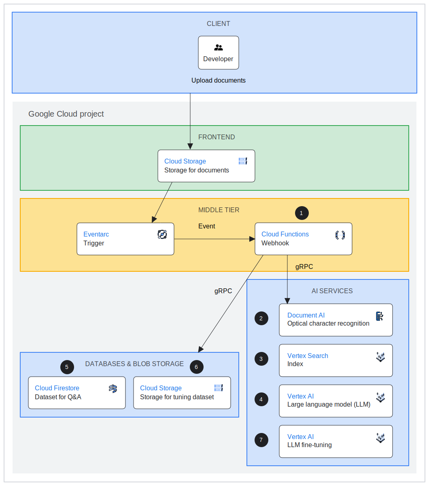

# Generative AI Knowledge Base

## Description
### Tagline
Fine tune an LLM model to answer questions from your documents.

### Detailed
This solution showcases how to extract question & answer pairs out of documents using Generative AI. It provides an end-to-end demonstration of QA extraction and fine-tuning of a large language model (LLM) on Vertex AI. Along the way, the solution utilizes Document AI Character Recognition (OCR), Firestore, Vector Search, Vertex AI Studio, and Cloud Functions.

## Architecture

- Uploading a new document triggers the webhook Cloud Function.
- Document AI extracts the text from the document file.
- Indexes the document text in Vector Search.
- A Vertex AI Large Language Model generates questions and answers from the document text.
- The questions and answers pairs are saved into Firestore.
- A fine tuning dataset is generated from the Firestore database.
- After human validation, a fine tuned Large Language Model is deployed and saved in the Model Registry.

## Prerequisites
- [Google Cloud Project](https://cloud.google.com/resource-manager/docs/creating-managing-projects)

## Documentation
- [Knowledge Base using Generative AI](assets/architecture_diagram.svg)

## Deployment Duration
Configuration: 2 mins
Deployment: 6 mins

## Cost
[Cost Details](https://cloud.google.com/products/calculator-legacy#id=dcdd11ca-ca20-428b-86be-1c9b3c651042)

<!-- BEGINNING OF PRE-COMMIT-TERRAFORM DOCS HOOK -->
## Inputs

| Name | Description | Type | Default | Required |
|------|-------------|------|---------|:--------:|
| disable\_services\_on\_destroy | Whether project services will be disabled when the resources are destroyed. | `bool` | `false` | no |
| documentai\_location | Document AI location, see https://cloud.google.com/document-ai/docs/regions | `string` | `"us"` | no |
| firestore\_location | Firestore location, see https://firebase.google.com/docs/firestore/locations | `string` | `"nam5"` | no |
| initial\_index\_json\_path | Path to the initial (placeholder) Vector Search index | `string` | `"initial-index.json"` | no |
| labels | A set of key/value label pairs to assign to the resources deployed by this blueprint. | `map(string)` | `{}` | no |
| project\_id | The Google Cloud project ID to deploy to | `string` | n/a | yes |
| region | The Google Cloud region to deploy to | `string` | `"us-central1"` | no |
| unique\_names | Whether to use unique names for resources | `bool` | `true` | no |
| webhook\_path | Path to the webhook source directory | `string` | `"webhook"` | no |

## Outputs

| Name | Description |
|------|-------------|
| bucket\_docs\_name | The name of the docs bucket created |
| bucket\_main\_name | The name of the main bucket created |
| docs\_index\_endpoint\_id | The ID of the docs index endpoint |
| docs\_index\_id | The ID of the docs index |
| documentai\_processor\_id | The full Document AI processor path ID |
| firestore\_database\_name | The name of the Firestore database created |
| neos\_tutorial\_url | The URL to launch the in-console tutorial for the Generative AI Knowledge Base solution |
| predictions\_notebook\_url | The URL to open the notebook for model predictions in Colab |
| unique\_id | The unique ID for this deployment |

<!-- END OF PRE-COMMIT-TERRAFORM DOCS HOOK -->

## Requirements

These sections describe requirements for using this module.

### Software

The following dependencies must be available:

- [Terraform][terraform] v0.13
- [Terraform Provider for GCP][terraform-provider-gcp] plugin v5.8

### Service Account

A service account with the following roles must be used to provision
the resources of this module:

- Storage Admin: `roles/storage.admin`

The [Project Factory module][project-factory-module] and the
[IAM module][iam-module] may be used in combination to provision a
service account with the necessary roles applied.

### APIs

A project with the following APIs enabled must be used to host the
resources of this module:

- Google Cloud Storage JSON API: `storage-api.googleapis.com`

The [Project Factory module][project-factory-module] can be used to
provision a project with the necessary APIs enabled.

## Contributing

Refer to the [contribution guidelines](./docs/CONTRIBUTING.md) for
information on contributing to this module.

[iam-module]: https://registry.terraform.io/modules/terraform-google-modules/iam/google
[project-factory-module]: https://registry.terraform.io/modules/terraform-google-modules/project-factory/google
[terraform-provider-gcp]: https://www.terraform.io/docs/providers/google/index.html
[terraform]: https://www.terraform.io/downloads.html

## Security Disclosures

Please see our [security disclosure process](./SECURITY.md).
